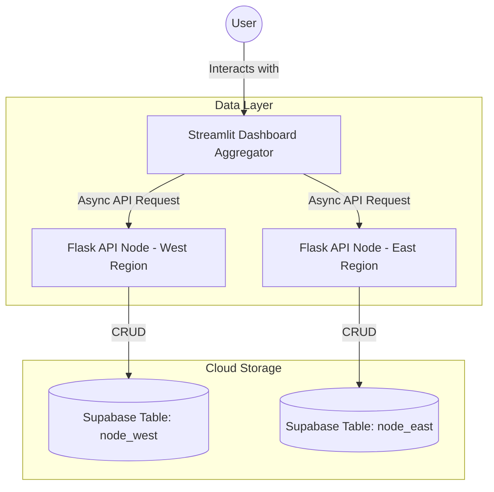

# 🛒 Cloud-Based Distributed E-commerce Analytics Platform


A distributed e-commerce data analytics platform designed to solve the challenges of processing large-scale sales data across geographically dispersed regions. By sharding business data between **West Malaysia** and **East Malaysia** nodes, this system leverages distributed aggregation techniques to deliver a **real-time, high-performance, and highly available** business intelligence dashboard.

---

## 🎯 Why I Built This

As businesses expand across regions, relying on a single centralized database often leads to bottlenecks, high latency, and a single point of failure. I built this project to demonstrate how **Distributed System Architecture** can address these issues by splitting the load, improving query performance through parallel processing, and ensuring system resilience even when partial network failures occur.

---

## 🌟 Key Technical Achievements

This project implements four core distributed systems concepts:

1. **Data Sharding (Horizontal Partitioning)**
   * Data is geographically partitioned into two independent logical nodes (West & East Malaysia), effectively distributing the storage load and reducing the size of queries on individual databases.
2. **Parallel Aggregation (Scatter-Gather Pattern)**
   * The Streamlit Dashboard acts as an aggregator, utilizing `httpx` and `asyncio` to fetch data from all distributed nodes concurrently.
   * **Result:** System latency is dictated by the slowest individual node rather than the sum of all nodes, significantly cutting down data retrieval time.
3. **Intelligent Data Routing**
   * The platform features a unified entry point that automatically routes new order writes to the correct geographic server node based on business logic (e.g., Region attributes).
4. **Fault Tolerance & Partial Availability**
   * Designed to handle partial node failures gracefully. If the East Node goes offline, the Dashboard continues to function and render analytics using data from the surviving West Node, ensuring uninterrupted business continuity.

---

## 📐 System Architecture

The system follows a microservice-inspired architecture pattern with decentralized data stores synchronized via Supabase.



---

## 🛠️ Tech Stack

*   **Frontend**: Streamlit (Python-based interactive dashboard)
*   **Backend Nodes**: Flask (RESTful API nodes)
*   **Cloud Database**: Supabase (Postgres with Real-time capabilities)
*   **Concurrency**: Httpx + Asyncio for non-blocking I/O operations
*   **Visualization**: Plotly Express for dynamic, interactive charts

---

## 📸 Dashboard Preview
*(Add a screenshot or GIF of your dashboard here before posting!)*
<!-- Example:  -->

### Core Features:
*   **Live Performance Metrics**: Aggregated revenue and order counts across regions.
*   **Dual-Region Trend Analysis**: Real-time monthly sales comparisons using distinct color coding.
*   **Node Monitoring Center**: Real-time tracking of node online status, response latency (ms), and data volume.
*   **Distributed Order Entry**: Enter new sales data directly from the dashboard with automatic region routing.
*   **Multi-dimensional Filters**: Slice and dice data by Region, Category, and Date range.
*   **Report Export**: One-click CSV export of aggregated and filtered data.

---

## 🚀 Getting Started

### 1. Prerequisites
Ensure Python 3.x is installed and install the necessary dependencies:
```bash
pip install streamlit flask pandas requests httpx supabase plotly
```

### 2. Environment Setup
*(Since this is a public repository, you will need your own Supabase project credentials to run the nodes.)*
*   Set up a Supabase project with two tables: `node_west` and `node_east`.
*   Update the `SUPABASE_URL` and `SUPABASE_KEY` placeholders in `node_west.py` and `node_east.py`.

### 3. Start Distributed Nodes
Open two independent terminal windows to start the West and East data servers:
```bash
# Terminal 1: Start West Node (Port 5001)
python node_west.py

# Terminal 2: Start East Node (Port 5002)
python node_east.py
```

### 4. Launch Analytics Dashboard
In a third terminal window, run the main application:
```bash
streamlit run dashboard.py
```

---

## 🤝 Let's Connect!
I am actively looking for opportunities in Software Engineering, Backend Development, and Data Analytics. If you find this project interesting, feel free to reach out to me!

[](https://linkedin.com/in/your-profile-link-here)

*If you liked this project, please consider giving it a ⭐!*
