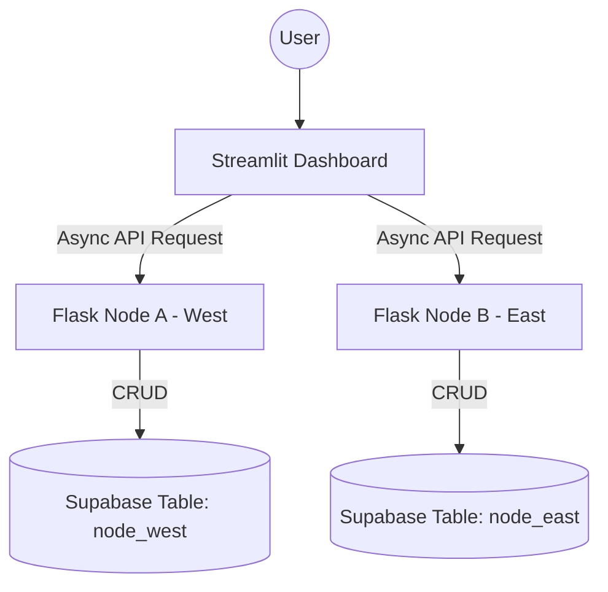

# 🛒 Distributed E-commerce Analytics Platform

本项目是一个基于分布式系统架构的电商数据分析平台。通过将马来西亚（西马与东马）的业务数据分片存储，并利用分布式聚合技术，实现实时、高效、高可用的经营分析仪表盘。

---

## 🌟 分布式系统核心特性 (Key Distributed Features)

本项目深入实践了分布式系统的四大核心理念：

1.  **数据分片 (Data Sharding)**
    *   数据根据地理区域（West & East Malaysia）进行水平分片，分别存储在独立的逻辑节点中，有效分散存储压力。
2.  **并行聚合 (Parallel Aggregation)**
    *   Dashboard 采用 `httpx` + `asyncio` 异步并行技术，同时向所有分布节点发起数据请求。
    *   **优点**：系统响应速度取决于最慢的单个节点，而非所有节点的耗时总和，极大提升了大数据量下的加载效率。
3.  **智能路由 (Intelligent Routing)**
    *   在录入新订单时，系统根据业务逻辑（Region）自动将写操作路由至对应的服务器节点（Port 5001 或 5002）。
4.  **高可用性与部分容错 (High Availability & Partial Failure Handling)**
    *   系统具备处理局部故障的能力。若其中一个节点（如东马节点）离线，Dashboard 依然能通过存活节点展示部分数据，保证了系统的连续性。

---

## 🛠️ 技术栈 (Tech Stack)

*   **前端展示**：Streamlit (Python-based interactive dashboard)
*   **后端节点**：Flask (RESTful API nodes)
*   **云端数据库**：Supabase (PostgreSQL with Real-time capabilities)
*   **并发处理**：Httpx + Asyncio
*   **数据可视化**：Plotly Express

---

## 🚀 快速开始 (Getting Started)

### 1. 环境准备
确保已安装 Python 3.x，并安装必要依赖：
```bash
pip install streamlit flask pandas requests httpx supabase plotly
```

### 2. 启动分布式节点
你需要打开两个独立的终端窗口，分别启动西马和东马的数据服务器：
```bash
# 终端 1: 启动西马节点 (Port 5001)
python node_west.py

# 终端 2: 启动东马节点 (Port 5002)
python node_east.py
```

### 3. 启动分析仪表盘
在第三个终端窗口运行主程序：
```bash
streamlit run dashboard.py
```

---

## 📊 功能模块

*   **实时指标监测**：聚合全马收入、订单量，并对比东西马业绩。
*   **双轴趋势分析**：通过颜色区分（绿-西马，橙-东马）实时对比不同区域的月度销售走势。
*   **节点监控中心**：侧边栏实时监测各节点的在线状态、响应延迟（ms）以及返回的数据行数。
*   **分布式订单录入**：支持新业务数据的实时录入与自动路由分发。
*   **多维数据过滤**：支持按地区、商品分类、日期范围进行秒级筛选。
*   **报表导出**：支持将筛选后的聚合数据一键导出为 CSV 格式。

---

## 📐 系统架构图


