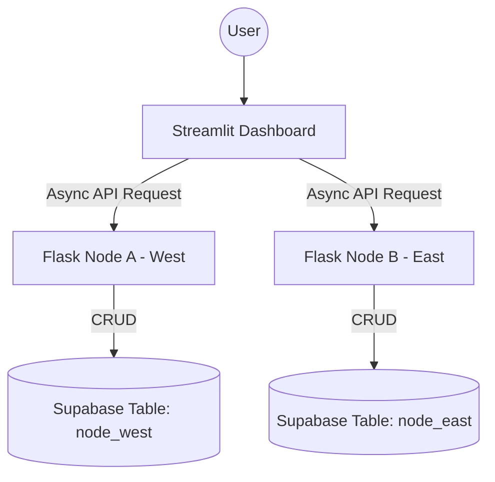

# 🛒 Cloud-Based Distributed E-commerce Analytics Platform

This project is a distributed e-commerce data analytics platform. It shards business data between West and East Malaysia and utilizes distributed aggregation techniques to provide a real-time, high-performance, and high-availability business analysis dashboard.

---

## 🌟 Key Distributed Features

This project implements four core concepts of distributed systems:

1.  **Data Sharding**
    *   Data is horizontally partitioned by geographic region (West & East Malaysia) and stored in independent logical nodes, effectively distributing the storage load.
2.  **Parallel Aggregation**
    *   The Dashboard uses `httpx` + `asyncio` for concurrent data requests to all distributed nodes.
    *   **Benefit**: System latency depends on the slowest individual node rather than the sum of all nodes, greatly improving performance for large datasets.
3.  **Intelligent Routing**
    *   When registering new orders, the system automatically routes write operations to the correct server node (Port 5001 or 5002) based on the "Region" business logic.
4.  **High Availability & Partial Failure Handling**
    *   The system can handle partial failures. If one node (e.g., East Node) goes offline, the Dashboard continues to function using data from the surviving nodes, ensuring business continuity.

---

## 🛠️ Tech Stack

*   **Frontend**: Streamlit (Python-based interactive dashboard)
*   **Backend Nodes**: Flask (RESTful API nodes)
*   **Cloud Database**: Supabase (Postgres with Real-time capabilities)
*   **Concurrency**: Httpx + Asyncio
*   **Visualization**: Plotly Express

---

## 🚀 Getting Started

### 1. Prerequisites
Ensure Python 3.x is installed and install the necessary dependencies:
```bash
pip install streamlit flask pandas requests httpx supabase plotly
```

### 2. Start Distributed Nodes
Open two independent terminal windows to start the West and East data servers:
```bash
# Terminal 1: Start West Node (Port 5001)
python node_west.py

# Terminal 2: Start East Node (Port 5002)
python node_east.py
```

### 3. Launch Analytics Dashboard
In a third terminal window, run the main application:
```bash
streamlit run dashboard.py
```

---

## 📊 Features

*   **Live Performance Metrics**: Aggregated revenue and order counts for both regions.
*   **Dual-Region Trend Analysis**: Real-time monthly sales comparison using color coding (Green: West, Orange: East).
*   **Node Monitoring Center**: Sidebar tracking for online status, response latency (ms), and row counts.
*   **Distributed Order Entry**: Real-time data entry with automatic routing.
*   **Multi-dimensional Filters**: Filter by Region, Category, and Date range.
*   **Report Export**: Download the aggregated and filtered data as a CSV report.

---

## 📐 Architecture Diagram


